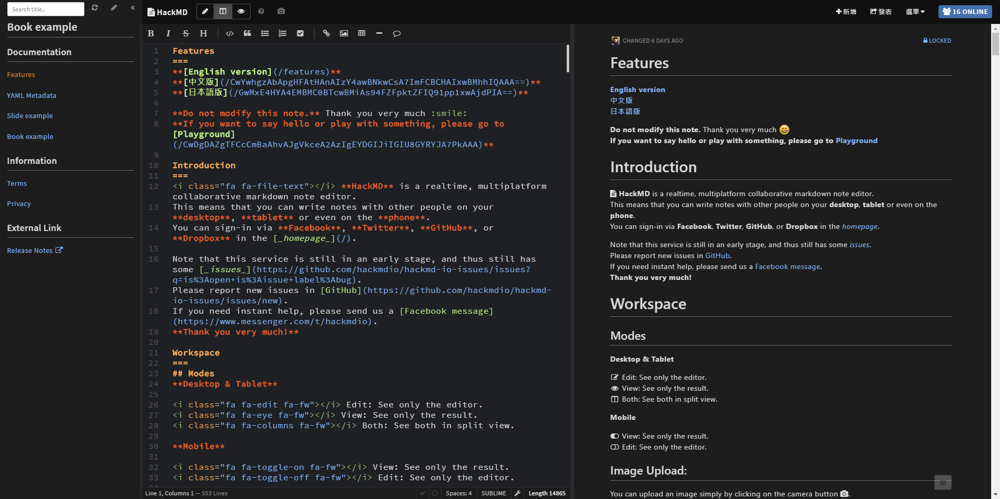
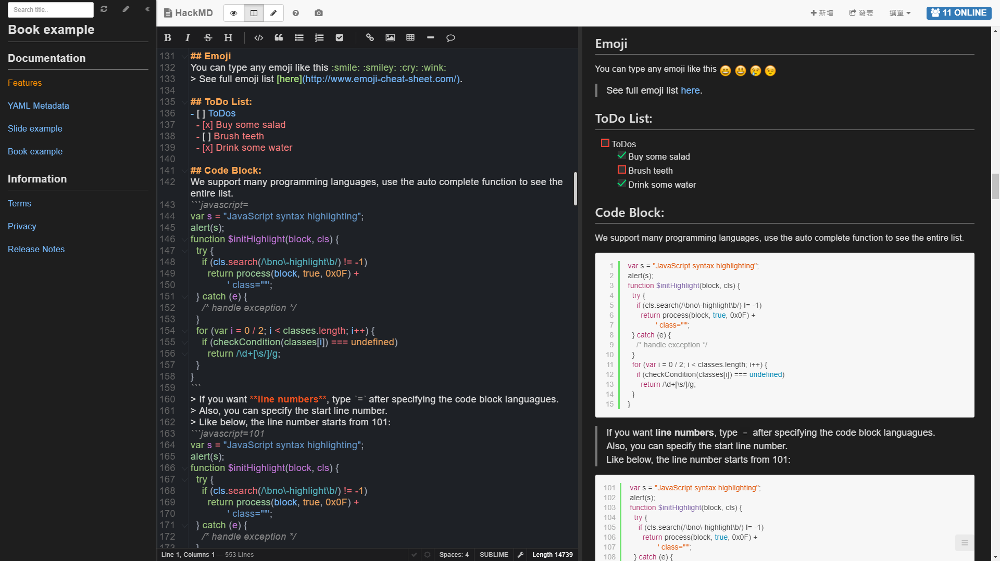
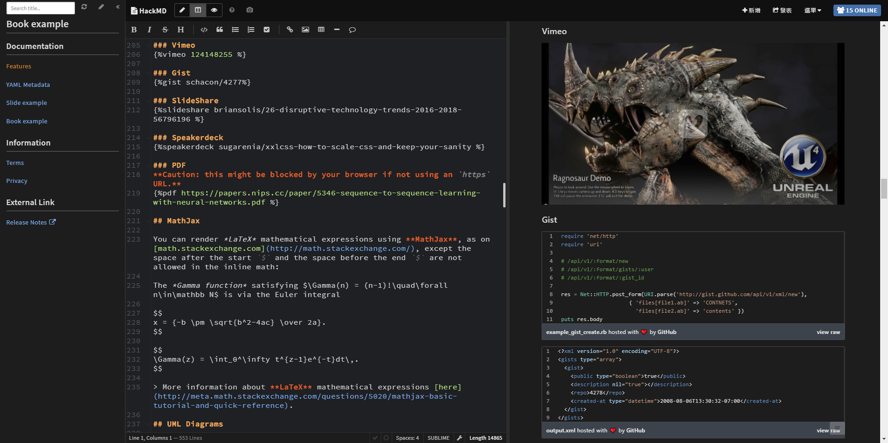
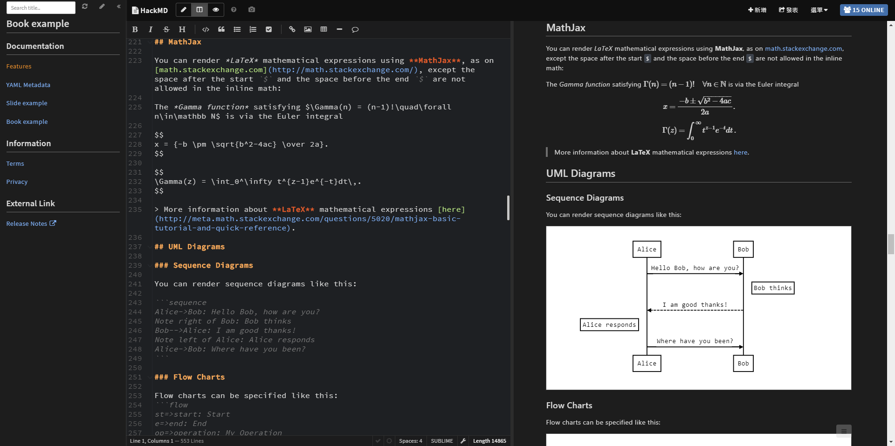
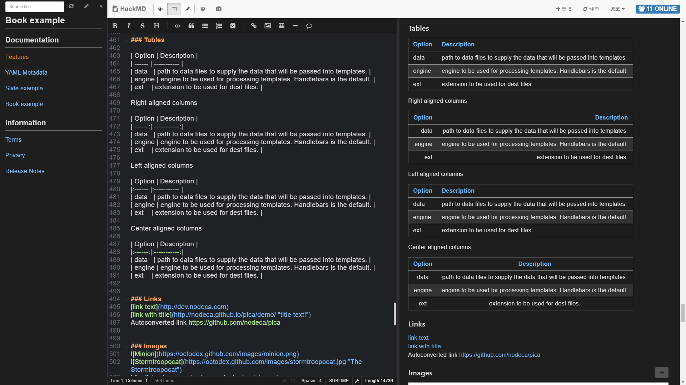
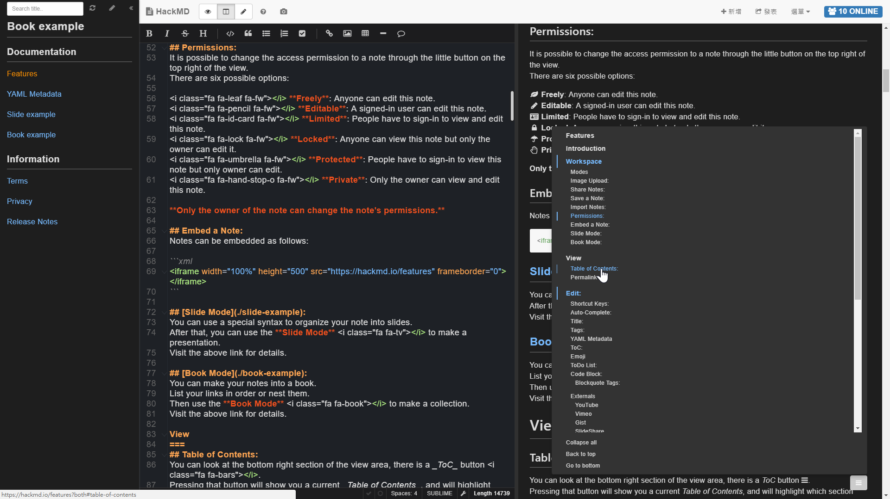
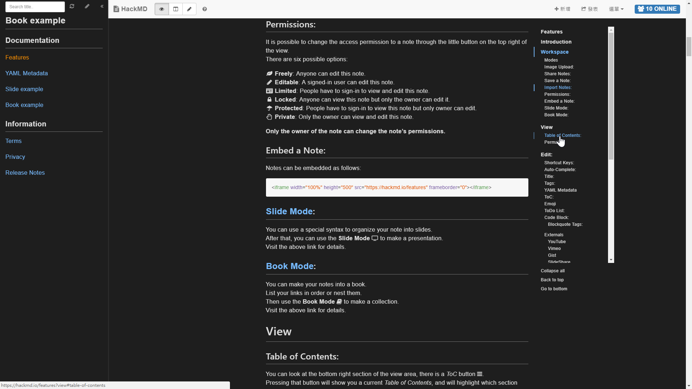
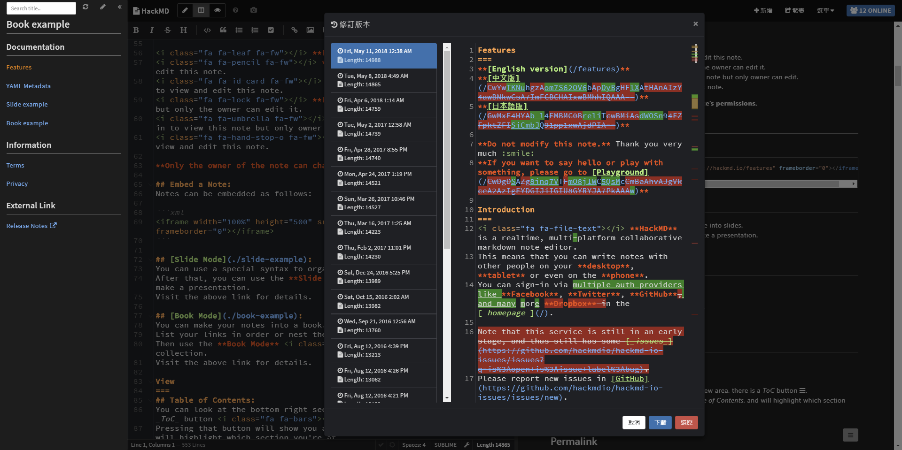

# hackmd-dark-theme
Dark theme for HackMD

## Installing
Install browser extension: Stylish - get the addon for [Firefox](https://addons.mozilla.org/en-US/firefox/addon/2108/), [Chrome](https://chrome.google.com/extensions/detail/fjnbnpbmkenffdnngjfgmeleoegfcffe), [Opera](https://addons.opera.com/en/extensions/details/stylish/), [Safari](http://sobolev.us/stylish/) and [Firefox Mobile](https://addons.mozilla.org/en-US/firefox/addon/2108/).

Then install this style using: [userstyles.org](https://userstyles.org/styles/147272/hackmd-dark-theme)

## Screenshots
### Book mode

### Code highlight

### Github Gist

### LaTeX

### Table

### ToC (Table of Contents)

### View mode

### History

