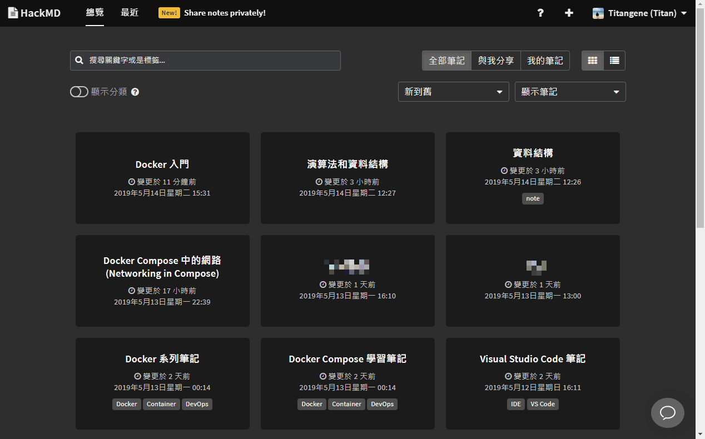
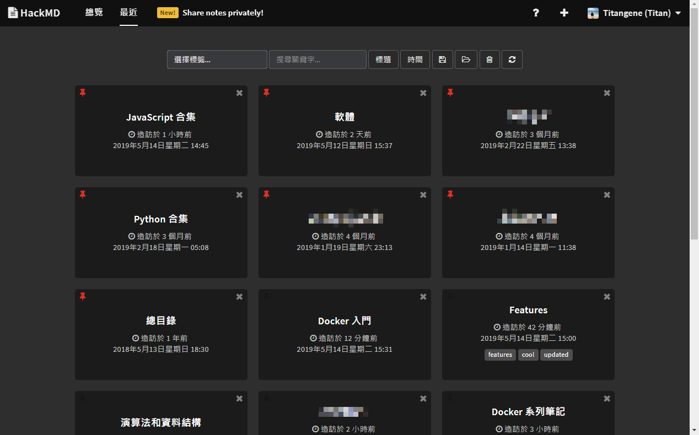
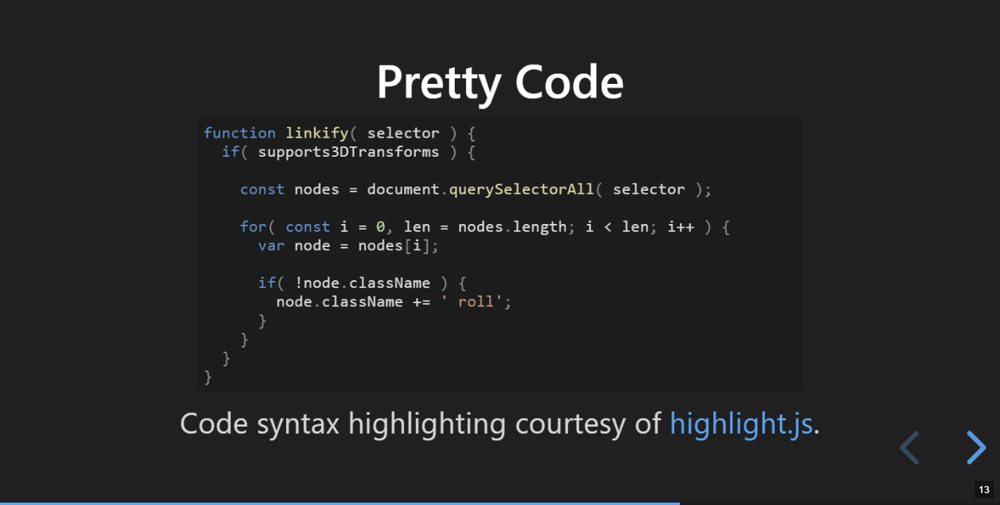
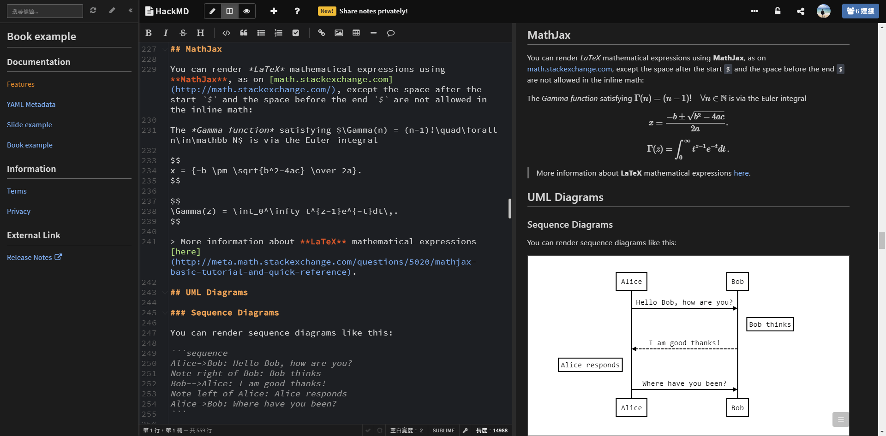
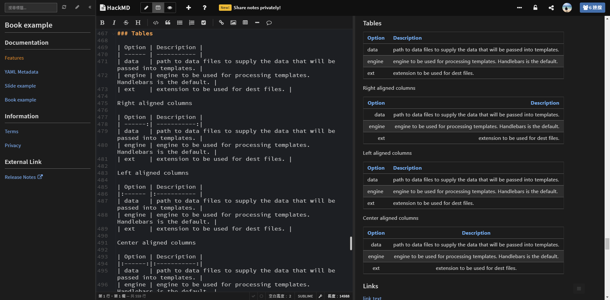
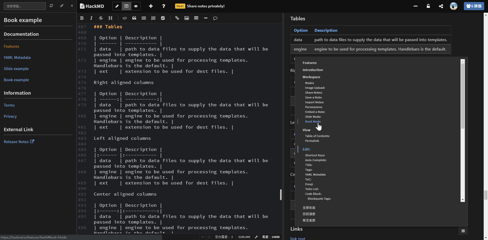
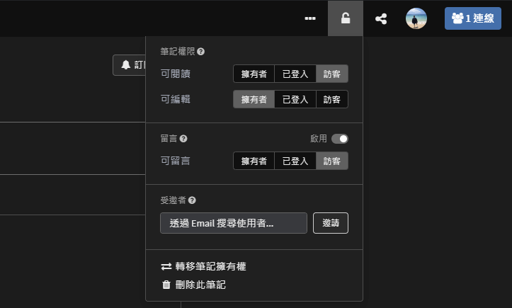
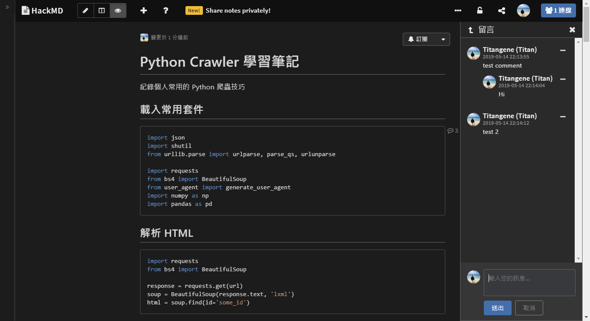

# hackmd-dark-theme
Dark theme for HackMD

## Installing
Install browser extension: Stylus - get the addon for [Chrome](https://chrome.google.com/webstore/detail/stylus/clngdbkpkpeebahjckkjfobafhncgmne), [Firefox](https://addons.mozilla.org/zh-TW/firefox/addon/styl-us/) and [Opera](https://addons.opera.com/zh-tw/extensions/details/stylus/).

Then install this style using: [userstyles.org](https://userstyles.org/styles/147272/hackmd-dark-theme)

## Screenshots
### Overview

### Recent

### View mode

### Book mode

### Slide mode

### Emoji & Todo list & Code block highlight

### Github Gist

### LaTeX & UML

### Table

### ToC (Table of Contents)

### History

### Permission

### Comment

